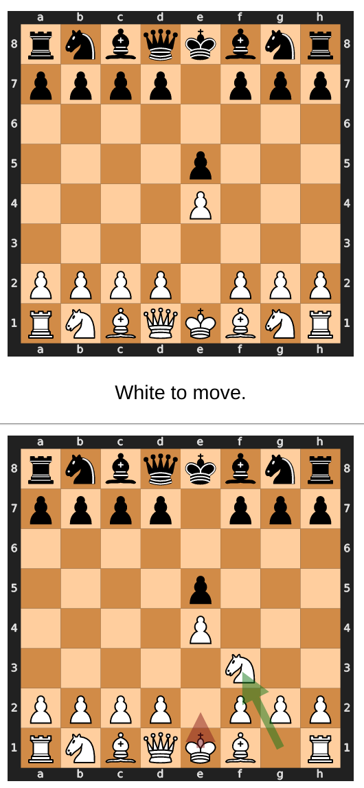
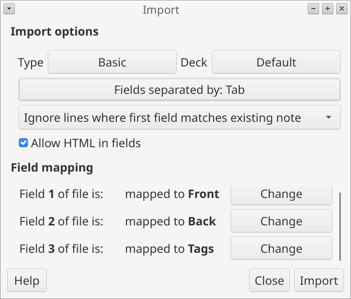

# Chess Opening Mistakes for Anki

<figure>

<figcaption>

**Red**: Mistake. **Green**: Book move.

</figcaption>
</figure>

---

This script will create a CSV file containing your opening mistakes. when you import it into Anki, make sure that you select "Fields separated by: Tab".

<figure>

</figure>

The script is designed to be accessible to users with only very basic command line knowledge. When you run it without any arguments, it will offer to install its dependencies, download your lichess games to analyze, and download necessary opening books.

## Help Text

```
usage: opening-mistakes-anki [-h] [-g GAMES_PGN] [-p PLAYER_NAME] [-b OPENING_BOOK] [-l LIMIT] [-c CARD_COUNT] [-t THRESHOLD] [-o OUTPUT_FILE]

Searches a PGN file for opening mistakes and writes them to a CSV that can be imported into Anki

optional arguments:
  -h, --help            show this help message and exit
  -g GAMES_PGN, --games-pgn GAMES_PGN
                        A collection of games in PGN format.
  -p PLAYER_NAME, --player-name PLAYER_NAME
                        The name, as it appears in the PGN file, of the player who wants to find their opening mistakes.
  -b OPENING_BOOK, --opening-book OPENING_BOOK
                        An opening book in polyglot format, used to identify mistakes.
  -l LIMIT, --limit LIMIT
                        The maximum number of games to look at. Default: unbounded.
  -c CARD_COUNT, --card-count CARD_COUNT
                        The maximum number of cards to generate. Default: unbounded.
  -t THRESHOLD, --threshold THRESHOLD
                        The number of times a mistake must have been made for it to be included. Default: 2
  -o OUTPUT_FILE, --output-file OUTPUT_FILE
                        The file to write the CSV to.
```
